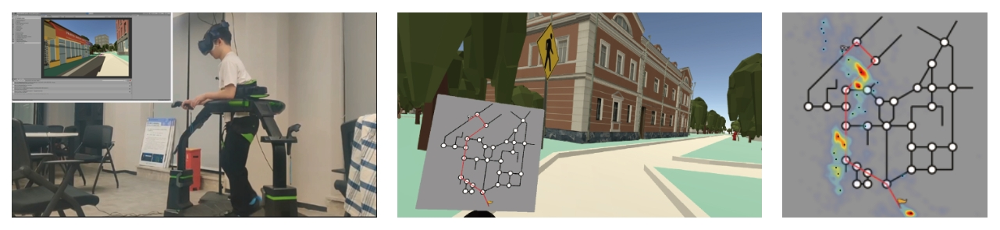
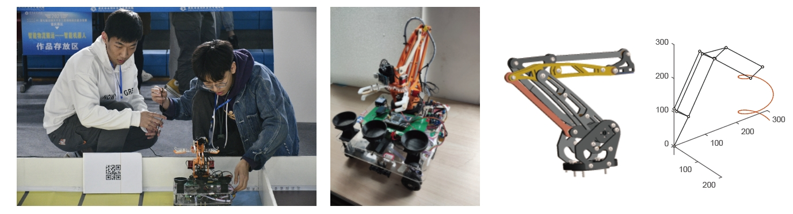

I'm a third year graduate student from CQU-HCI Lab, [Chongqing University](https://www.cqu.edu.cn/). My research focuses on human–computer interaction, virtual reality and spatial cognition.

- Master (2022-), Human–computer interaction (Ergonomic) (Supervisor: [Jia Zhou](https://www.researchgate.net/profile/Jia-Zhou-30)), Chongqing University
- Bachelor (2018-2022), Industry Design, Chongqing University

You can find my CV here: [Zhu Yifan's Curriculum Vitae](../assets/Zhuyifan_cv_Web.pdf).

---

# Publications

  
   
1

   
Quantifying spatial ability through digital traces in mobile  navigation games (2024) <b>Zhu, Yifan.</b>, Zuo, Yanling., Sun, Guolong., Zhou, Jia*.

22nd Triennial Congress of the International Ergonomics Association 2024
<a href="">On pressing</a>
 

  
   
1

   
A Human Centered Algorithmic Management Framework:  A Literature Review (2024) Jiang, Yushan., Fan, Shixin., <b>Zhu, Yifan.</b>, Wang, long., et.al

HCI International 2023
<a href="">On pressing</a>
 

  
   
1

   
What Prevents Us From Learning Virtual Reality Space: A Study  of Indoor Corridor Angle and Obstacle Transparency (2024) <b>Zhu, Yifan.</b>, Liu, Mingjun., Zhou, Jia*.

International Journal of Human–Computer Interaction (IJHCI) 
<a href="https://www.tandfonline.com/doi/abs/10.1080/10447318.2024.2364473/">DOI</a>
 

  
   
1

   
The Association Between Academic Clickbait and Impact: From  the Perspective of Online Media News (2023) <b>Zhu, Yifan.</b>, Li, Xin., Jiang, Yushan., Zhou, Jia*.

HCI International 2023
<a href="https://doi.org/10.1007/978-3-031-48044-7_32">DOI</a>

# Working paper

  
   
1

   
Reading digital maps while walking in virtual reality environment:   Improving pedestrian safety and level of natural interaction <b>Zhu, Yifan.</b>,  Zhou, Jia*.

-
<a href="">Under review</a>
 

  
   
1

   
Denser Grid Patterns Correlate with More Precise Spatial   Cognition <b>Zhu, Yifan.</b>, Cao, Jingjing., Zuo, Yanling., Liu, Mingjun., et.al.

-
<a href="">Under review</a>

# Skills

<b>Human-computer interaction</b>
Statistics, User Study, Persona, Usability Evaluation and Test, Survey Study, Experiment Design, UX/UI design

 <b>Code</b>
Matlab, C(C#, C++), R, Python, Batch command

 <b>Design</b>
Photoshop, Illustrator, Xd

<b>Virtual reality development</b>
Digital trace & Eye tracking based on Unity engine (Steam VR) 

  

<b>Hardware development (IoT)</b>
Based on stm32, Infineon K60, et.al. 

  

